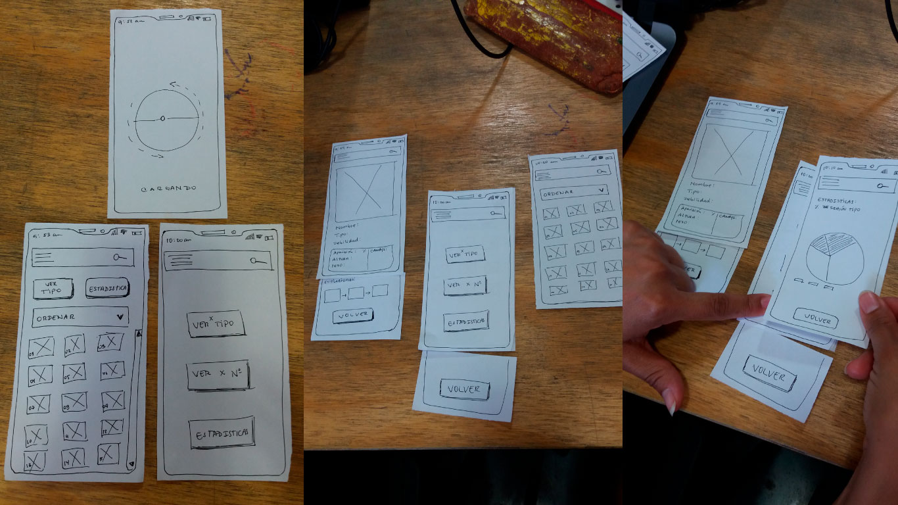
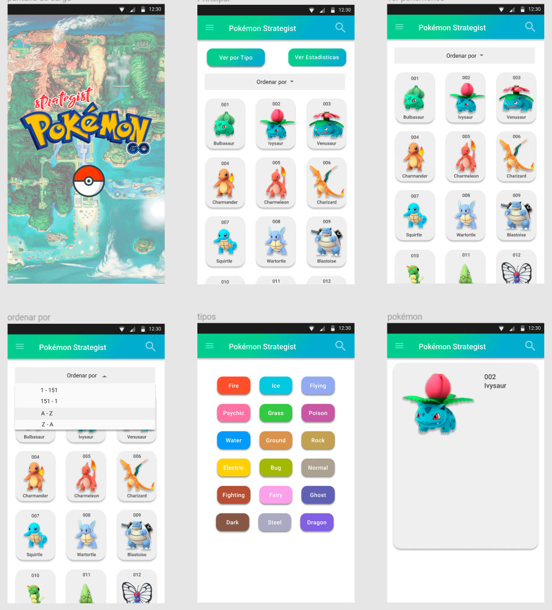
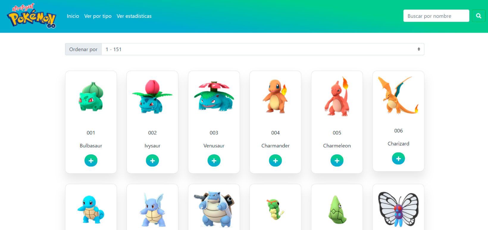
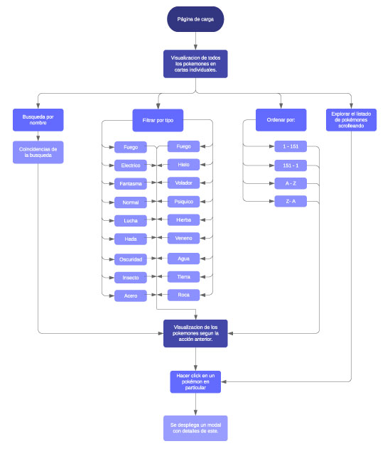

### Definición del Producto

Pokémon GO es un juego que ha mantenido interesados a sus jugadores brindándoles la posibilidad de ser entrenadores pokémon, es esta ilusión de poder ser el mejor es la que durante estos ya casi 3 años de vida del juego han perseguido millones de jugadores alrededor del mundo. Capturar el mayor número de pokémones puede ser una tarea simple en un comienzo pero lograr completar la pokédex es una tarea ardua, en la cual conocer detalles específicos sobre los pokémones permite generar una mejor estrategia de juego y optimizar el tiempo de juego. 

Considerando lo anterior es que desarrollamos Strategist Pokémon es una aplicación web simple e intuitiva, ideal para usar desde el dispositivo móvil, que te permite explorar a los pokémones de isla kanto, realizar búsquedas por nombre, filtrar según tipo y acceder a una tarjeta personalizada de un pokemon en particular en donde encontrarás información específica como el número de candy’s necesarios para evolucionar, la hora en que es más posible lograr su captura y las debilidades según su tipo, te permitirán generar una estrategia de juego más completa y eficaz.

### Definición del Usuario

El grupo de personas que juega Pokémon GO es bastante diverso ya que incluye a mujeres y hombres en un rango de edad que va desde los 10 años (quienes juegan acompañados de sus padres) hasta adultos sobre los 30 años. Debido a la diversidad de usuarios es que podemos definir varios usuarios dependiendo del propósito que los mantienen interesados en el juego. 

En esta oportunidad trabajaremos con quienes juegan Pokémon GO de forma regular, es decir, mujeres y hombres entre los 20 y los 35 años, quienes aprovechan la mayor parte de sus trayectos para jugar, están pendientes de abrir el juego cuando van a nuevos lugares y que también dedican tiempo exclusivo para realizar misiones y capturar pokémones entre otras acciones. 

Como resultado de una encuesta obtuvimos que los principales motivos que persiguen los jugadores van desde pasar el rato, divertirse, compartir con amigos, hasta coleccionar el mayor número de pokémones, caminar y completar la pokédex.

### Definición del Problema

Para los usuarios regulares Pokémon GO se vuelve muy importante conocer ciertas características específicas acerca de cada uno de los pokémones. Al preguntarle a nuestros usuarios sobre la pokédex incluida en el juego las opiniones están bastante divididas, a algunos les parece bien y bastante útil, a otros en cambio les parece incompleta, ya que no presenta toda la información que quisieran, les parece más bien una forma de coleccionar pokémones.

Considerando lo anterior es que vemos la ausencia de información relevante para los jugadores como; la cantidad de candy’s necesarios para evolucionar o las debilidades de un pokémon frente a otro según su tipo, no están disponibles en la pokédex que incorpora el juego. Conocer esta información permitirá a los jugadores generar una mejor estrategia de combate cuando vayan a generar un ataque y  tener certeza sobre el número de candy’s necesarios para lograr evolucionar, haciendo más eficaces las horas de juego y obteniendo mejores resultados. También el conocer el horarios y la probabilidad de aparición de un pokémon les permitiría hacer más eficaces sus capturas y tiempo de juego.

#### Síntesis de los resultados de la encuesta 

De  acuerdo a la encuesta realizada a 14 usuarios jugadores de Pokémon GO,se determinó los siguientes puntos:
- La mayoría de los jugadores son masculinos, entre 25 a 30 años los cuales dedican un aproximado de 4 horas semanales a jugar.
- La gran mayoría no les resulta interesante la pokédex que brinda la web, opinan que es incompleta, que podría ser más útil para así obtener mejor información de los pokemones.
- Un buen porcentaje contaron que es de gran importancia saber las debilidades y fortalezas de cada pokémon y utilizan aplicaciones o sitios web alternos para saber con más detalle de los pokemones; siendo Calcy IV la app más usada con un 25%.
La mayoría de los jugadores entrevistados juega por hobby y esparcimiento.
- Les resulta de gran relevancia tener una estrategia de juego para no sufrir en las batallas y así permitiéndoles subir de nivel.
- En cuanto a si juegan sólos o en grupo, hubo un empate 50%.

### Historias de Usuario 

#### 1
Como: jugador regular de pokémon go
Quiero: obtener más información un pokémon en particular (lider del gimnasio) antes de atacar.
Para: conocer en específico sus debilidades según tipo y considerando esto comenzar la búsqueda del pokémon más idóneo para atacar este gimnasio en particular.

Criterios de aceptación: 
- El usuario debe conocer por los menos las iniciales del nombre del pokémon para realizar una búsqueda.
- El usuario debe ingresar en la barra de búsqueda (input) el nombre del pokémon o parte de este.
- El filtro de búsqueda mostrará las coincidencias encontradas, según la búsqueda ingresada por el usuario se le muestran sugerencias.
- Al hacer click en alguna de las sugerencias se despliega un modal con una ficha del pokémon en cuestión.
- Si el usuario sólo reconoce al pokémon por su imagen puede scrollear hasta encontrarlo.

#### 2
Como: jugador regular de pokémon go
Quiero: filtrar los pokémones por tipo.
Para: poder identificar a los pokemones según un tipo en particular, con el fin de encontrar al pokemon más idóneo para atacar el gimnasio. 

Criterios de aceptación: 
- El usuario debe tener claro qué tipo de pokemones son los que quiere identificar.
- El usuario debe hacer click en búsqueda por tipo y marcar los tipo de pokémon que busca, se pueden marcar más de un tipo.
- Se despliegan las cartas de los pokémones que son del tipo solicitado
- Al hacer click en alguno de estos, se despliega un modal con detalles de este.
- Al explorar los pokémones disponibles el usuario puede evaluar sus posibilidades para atacar un gimnasio.

#### 3
Como: jugador regular de pokémon go
Quiero: conocer las probabilidades y los mejores horarios para capturar a los pokémones que me falta tener en la pokédex.
Para: poder optimizar mi tiempo de juego, y generar una mejor estrategia para capturar a los pokémones faltantes.

Criterios de aceptación: 
- El usuario debe conocer por los menos las iniciales del nombre del pokémon para realizar una búsqueda.
- El usuario debe ingresar en la barra de búsqueda (input) el nombre del pokémon o parte de este.
- El filtro de búsqueda mostrará las coincidencias encontradas, según la búsqueda ingresada por el usuario se le muestran sugerencias.
- Al hacer click en alguna de las sugerencias se despliega un modal con una ficha del pokémon en cuestión.
- En modal se indica información personalizada del pokémon, que incluye el porcentaje de aparición y el horario en el que es más factible su captura.

#### 4
Como: jugador regular de pokémon go
Quiero: conocer las evoluciones de un pokémon y los candy’s necesarios para ello.
Para: saber cuantos candy’s debo reunir para lograr hacer evolucionar a un pokémon determinado.

Criterios de aceptación: 
- El usuario debe conocer por los menos las iniciales del nombre del pokémon para realizar una búsqueda.
- El usuario debe ingresar en la barra de búsqueda (input) el nombre del pokémon o parte de este.
- El filtro de búsqueda mostrará las coincidencias encontradas, según la búsqueda ingresada por el usuario se le muestran sugerencias.
- Al hacer click en alguna de las sugerencias se despliega un modal con una ficha del pokémon en cuestión.
- En modal se indica información personalizada del pokémon, que incluye una línea evolutiva del pokémon que también indica el número de candy’s necesario para lograr dicha evolución.

### Conclusiones del testeo de baja calidad 

Realiazamos en testeo a 3 personas y las observaciones más relevantes de este proceso  fueron las siguientes:

1. Presentamos dos pantallas de inicio a los usuarios, la 1ra opción incluía en la misma pantalla botones, un selector y abajo de estos ya se visualizan los pokemones en cartas individuales. En la 2da opción la pantalla incluye 3 botones solamente, permitiendo escoger al usuario la información a visualizar. Concluimos que los usuarios prefieren ver la 1ra pantalla porque pueden ver información de inmediato, el paso intermedio de escoger les parece innecesario y les genera ansiedad ya que ellos quieren ver información de los pokemones.

2. En la siguiente pantalla el usuario puede visualizar detalles de un pokémon en particular, podrá ver datos como peso, altura, tipo, debilidad, % de aparición, cantidad de candy necesarios para evolucionar, etc. Según el feedback recibido debemos trabajar en la disposición en la que se mostrará esta información, para que sea atractiva y clara.

3. Otro detalle importante es posicionar la información de los candis necesarios para evolucionar en conjunto con la línea de evolución, para lograr tener una visión más completa.

4. También tenemos que trabajar en cómo integrar de manera cómoda la opción de volver a la página anterior, ya sea por medio de algun boton, o por medio de breadcrumb.

### Versión 1 

[Aqui puedes revisar la aplicación](https://majosalazar.github.io/scl-2018-12-bc-core-data-lovers/)

[Aqui puedes revisar nuestra planificación en Trello](https://trello.com/b/j5Rkq8ZW)

Tomando el feedback anterior es realizamos la siguiente propuesta de diseño, tomando como referente estético a pokémon GO con el fin de entregar la sensación de familiaridad al usuario. 
Desarrollamos la aplicación tomando en consideración que la necesidad de conocer más información en particular de un pokémon va a surgir cuando el jugador o jugadora esten usando el juego, por lo que accederan desde su dispositivo movil, lo que no impide que se pueda acceder desde computador.

[Aqui puedes revisar nuestro prototipo de alta calidad de la version 1](https://www.figma.com/file/GFTdqcDeaKQtMZ5Stsj80C/POKEMON-strategist-MAJO?node-id=0%3A1)

### Conclusiones del testeo de la versión 1

[Evaluación Heurística](https://drive.google.com/open?id=1c6sN3moCt-p-irEaLXEPjJA-NAfabqaguAjtRMiptvs)

1- La mayoría de los usuario considero que el logo en la parte superior era un enlace que le permitiría volver a la página de inicio.

2- Al realizar una búsqueda el hecho que tuviese que ingresar el nombre de un pokémon de “memoria” género que los resultados en la mayoría de los usuarios no funcionara. Tampoco al no ser exitosa la búsqueda se le indicaba al usuario, lo que generaba incertidumbre.

3- Los usuarios al realizar búsquedas por nombre, esperaban que al dar ENTER esta se realizará, esperaban unos instantes y luego presionar el botón de la lupa ya que no veían alguna respuesta.

4- El flujo de la aplicación no es fluido, ya que para realizar nuevas búsquedas o volver un paso, se requiere volver a la página inicial.

5- La tarjeta que muestra la información de un pokémon en particular necesita mostrar la información de manera jerárquica y diagramada, ya que no se ve mayor relevancia ni prioridad entre ella. También hay que trabajar en la forma en que se indica el tipo de pokémon, ya que al parecer un botón el usuario lo clickea esperando alguna acción.

### Flujo Versión 2

En base a todo el feedback recibido se realizó la siguiente iteración en el flujo de la aplicación, con el fin de más intuitivo su uso.

### Versión 2

[Aqui puedes revisar la nueva versión de Strategist Pokémon](https://www.figma.com/file/R8bd1zGfnqOBWf8q4Qm8CR/POKEMON-strategist-MAJO-versi%C3%B3n-2)

[Evaluacion Heurística](https://docs.google.com/spreadsheets/d/1qy8L0qxudDaxiyVDogkSvLjFkWE1LGZb3FYZ-74Nnxw/edit#gid=0)

